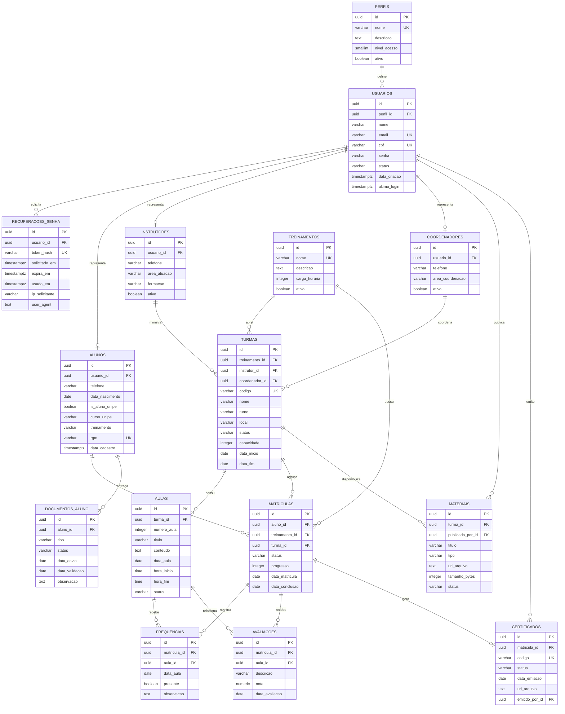

# Modelo entidade-relacionamento - ADM4All

Este documento descreve o modelo de dados para suportar aluno, instrutor,
coordenacao e administrador geral. `usuarios` centraliza autenticacao e cada
tabela de perfil guarda os dados especificos da sua funcao.

## Perfis do sistema

| Perfil | Uso previsto |
|---|---|
| `aluno` | Acessar dashboard pessoal, curso, faltas, notas, documentos e certificado |
| `instrutor` | Gerenciar turmas, presencas, aulas e materiais |
| `coordenador` | Acompanhar cursos, turmas, alunos, documentos e relatorios |
| `admin` | Gerenciar usuarios, permissoes e configuracoes gerais |

## Status padronizados

`usuarios.status`:

- `ativo`
- `inativo`
- `bloqueado`
- `pendente_ativacao`

`turmas.status`:

- `planejada`
- `em_andamento`
- `concluida`
- `cancelada`

`matriculas.status`:

- `em_andamento`
- `aprovado`
- `reprovado_falta`
- `cancelado`

`aulas.status`:

- `planejada`
- `realizada`
- `cancelada`

`documentos_aluno.status`:

- `pendente`
- `enviado`
- `aprovado`
- `recusado`

`certificados.status`:

- `pendente`
- `emitido`
- `cancelado`

## Observacoes para integracao

- Todo usuario possui CPF unico. O login universal consulta e-mail ou CPF em `usuarios`, valida
  `usuarios.senha` e usa `perfis.nome` para determinar a area de destino.
- `alunos`, `instrutores` e `coordenadores` apontam para `usuarios` por
  `usuario_id`; o contrato de login retorna tambem o ID do perfil especifico.
- `recuperacoes_senha` deve armazenar apenas o hash do token. O token puro
  deve existir somente no link enviado ao usuario.
- A expiracao padrao de recuperacao de senha e de 15 minutos. O backend deve
  consultar a ultima solicitacao do usuario antes de criar um novo token.
- `matriculas.turma_id` permite alimentar a tela do aluno e as telas do
  instrutor/coordenador com a mesma fonte de dados.
- `aulas`, `frequencias` e `materiais` sustentam a tela do instrutor.
- `certificados` permite gerar e consultar certificado quando a matricula for
  aprovada.
